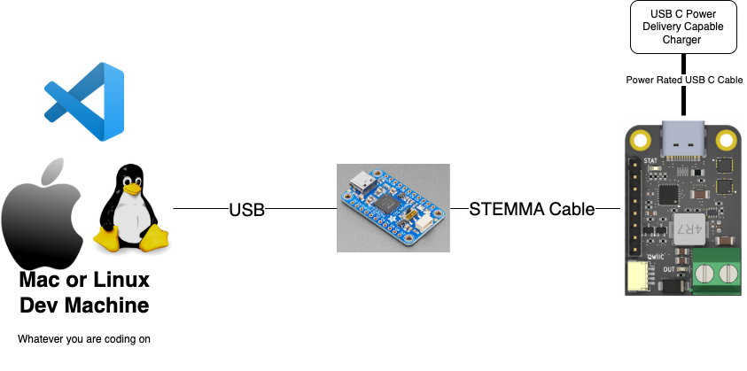

# Examples

## Summary

Within this directory are a set of examples for different platforms the goal being to show the developer how to use the driver on each platform. The driver should be platform agnostic and the API should be the same regardless of whether its in `async` or `sync` mode. The top level examples are `sync` examples which require a developer machine such as Linux or Mac and the [FT232H Breakout Board](https://www.adafruit.com/product/2264?srsltid=AfmBOoqZKJGbxdDMfqFI-Ee3Zng37fVCyA3U3QFtUmqNaYjc6E0aB_gg). The setup for this is shown in the diagram below:



The AP33772S Breakout board that is being used is from [CentyLab](https://github.com/CentyLab) and can be found on their on line [shop](https://hackaday.io/project/201953-rotopd-usb-c-pd-31-breakout-i2c).

Other examples can be found here:

- [ESP32C3](./esp32c3/)
- [Raspberry Pi](./raspberrypi/README.md)

### FT232H Setup

In order to use the FT232H breakout Board with rust you must do the following setup:

### How to Install (Desktop Linux)

When working with Desktop Linux you may find you need to install the following in order to work with the [FT232H](https://www.adafruit.com/product/2264) breakout board.

```bash
sudo apt update
sudo apt install libftdi1 libftdi1-dev
```

## How to Install (MacOS)

When working with MacOS you will need to install the following packages:

```bash
brew install libftdi
```

If you are having trouble it may be worth looking into:

- [CircuitPython Libraries on Any Computer with FT232H](https://learn.adafruit.com/circuitpython-on-any-computer-with-ft232h/mac-osx)

or subsequently brew might not install correctly the libftdi library. It may be worth unlinking and linking the library using the following command:

```bash
brew unlink libftdi && brew link libftdi
```

## Optional Dependencies

When listing usb devices you might find `lsusb` useful to which you will need to do the following:

### Linux

```bash
sudo apt update
sudo apt install lsusb
```

### MacOS

```bash
brew install lsusb
```

## How to Run

When running the examples you can then simply do the following

```bash
cargo run --example power_data_object_query --no-default-features --features sync
```

### FT232H on MAC

When working with [FT232H](https://www.adafruit.com/product/2264), you must find the right device id, this can be done by using `lsusb`:

```bash
❯ lsusb
Bus 003 Device 001: ID 1e91:4002 1e91 OWC Thunderbolt 3 Dock SD Card Reader  Serial: 000000001616
Bus 003 Device 002: ID 1e91:4001 1e91 OWC Thunderbolt 3 Audio Device
Bus 003 Device 007: ID 0403:6014 Future Technology Devices International Limited Composite Device # This is the device here!!
Bus 000 Device 001: ID 1d6b:XHCI
XHCI
XHCI
1100 Linux Foundation USB 3.1 Bus
Bus 000 Device 001: ID 1d6b:1100
XHCI Linux Foundation USB 3.0 Bus
```

These numbers should match the numbers utils [source code](../utils/src/lib.rs).
