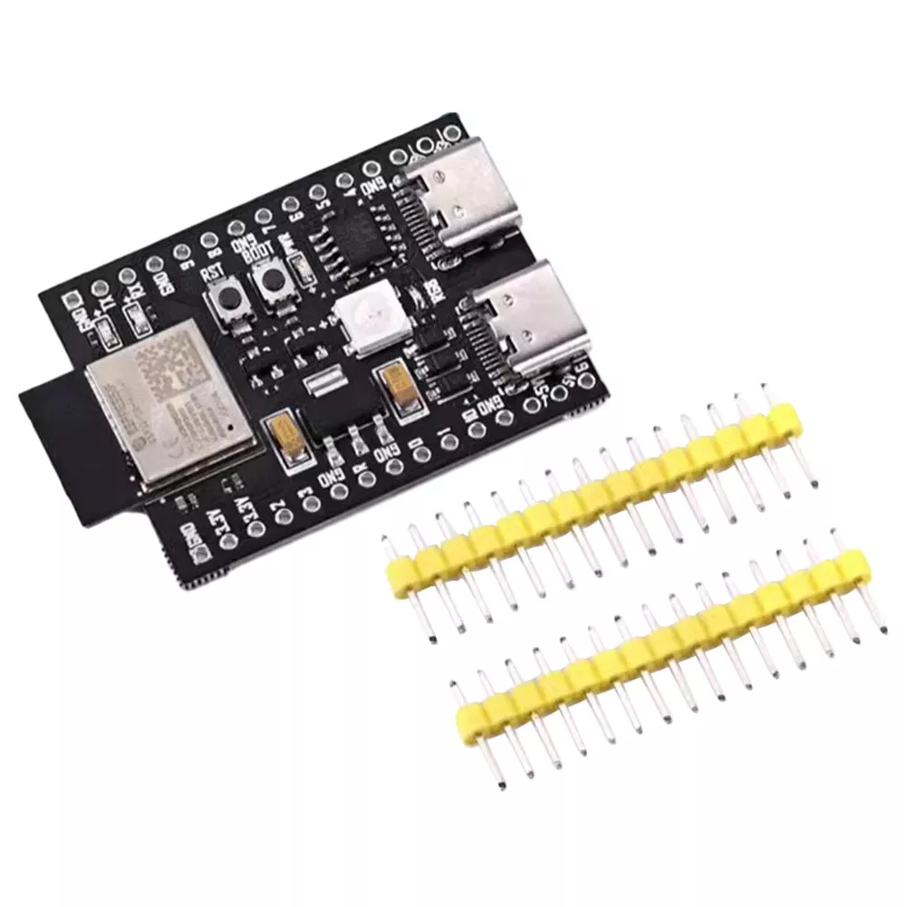

# ESP32C3 Example

## Summary

Similar to the examples [above](../README.md), this shows a simple ESP32 project using the [ESP32C3](https://www.adafruit.com/product/5405?srsltid=AfmBOoo1rUuZ3fomJMI596WgUUteJpeauPvo2lp8PkzyIh07Sx1iAuI7). It proves out that the driver is cross platform and can work on both `async` and `sync` systems. This example uses the driver in `async` mode with the [Embassy](https://embassy.dev/) framework.

## Hardware

As for specific hardware, the following development board was used:

It can be bought on [Ebay](https://www.ebay.co.uk/itm/136271789318?_ul=GB&campid=5339075985&mkcid=1&mkevt=1&mkrid=710-53481-19255-0&rb_itemId=136271789318&rb_pgeo=GB&toolid=10044&var=0&var=0&ff=11).
